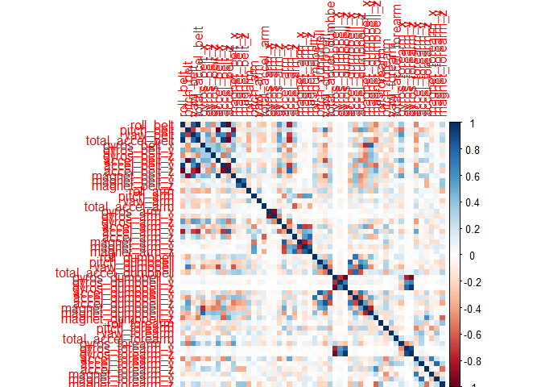
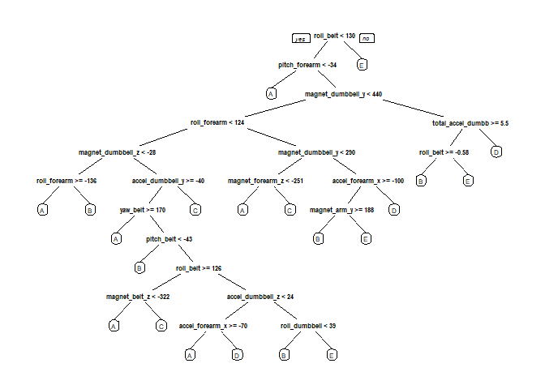

# Practical Machine Learning-Project
Santosh Pawar  
November 26, 2017  

# Tile: Quantifying excercise patterns and activities of individuals from accelerometer data

---

## Executive summary: 
Using devices such as Jawbone Up, Nike FuelBand, and Fitbit it is now possible to collect a large amount of data about personal activity relatively inexpensively. These type of devices are part of the quantified self movement - a group of enthusiasts who take measurements about themselves regularly to improve their health, to find patterns in their behavior, or because they are tech geeks. One thing that people regularly do is quantify how much of a particular activity they do, but they rarely quantify how well they do it.They Participants were asked to perform barbell lifts correctly and incorrectly in 5 different ways.
This project used data from accelerometers on the belt, forearm, arm, and dumbell of 6 participants to predict the manner in which they did the exercise.

--- 
 
##Data Preprocessing


```r
#Read the Data

trainRaw <- read.csv("pml-training.csv")
testRaw <- read.csv("pml-testing.csv")

dim(trainRaw)
```

```
## [1] 19622   160
```

```r
dim(testRaw)
```

```
## [1]  20 160
```

The training data set contains 19622 observations (rows) and 160 variables (columns), while the testing data set contains 20 observations and 160 variables. The "classe" variable in the training set is the outcome to predict.

---

##Clean the data

```r
#Data is cleaned to remove observations with missing values and some meaningless variables

sum(complete.cases(trainRaw))
```

```
## [1] 406
```

```r
#Remove columns that contain NA missing values

trainRaw <- trainRaw[, colSums(is.na(trainRaw)) == 0] 
testRaw <- testRaw[, colSums(is.na(testRaw)) == 0] 

#Remove columns that do not contribute much to the accelerometer measurements

classe <- trainRaw$classe
trainRemove <- grepl("^X|timestamp|window", names(trainRaw))
trainRaw <- trainRaw[, !trainRemove]
trainCleaned <- trainRaw[, sapply(trainRaw, is.numeric)]
trainCleaned$classe <- classe

testRemove <- grepl("^X|timestamp|window", names(testRaw))
testRaw <- testRaw[, !testRemove]
testCleaned <- testRaw[, sapply(testRaw, is.numeric)]

dim(trainCleaned)
```

```
## [1] 19622    53
```

```r
dim(testCleaned)
```

```
## [1] 20 53
```

The cleaned training data set now contains 19622 observations and 53 variables, while the testing data set contains 20 observations and 53 variables. The "classe" variable is still in the cleaned training set.

---

##Slice the data
Split the cleaned training set into a training data set (70%) and a validation data set (30%). The validation data set is used to perform cross validation.


```r
# Set seed for reproducibility of data
set.seed(12345) 

#Partition data
inTrain <- createDataPartition(trainCleaned$classe, p=0.70, list=F)
trainData <- trainCleaned[inTrain, ]
testData <- trainCleaned[-inTrain, ]
```

---

##Data Modeling

```r
#Fit a predictive model for activity recognition using Random Forest algorithm. Five-fold cross validation is performed.

controlRf <- trainControl(method="cv", 5)

modelRf <- train(classe ~ ., data=trainData, method="rf", trControl=controlRf, ntree=250)
modelRf
```

```
## Random Forest 
## 
## 13737 samples
##    52 predictor
##     5 classes: 'A', 'B', 'C', 'D', 'E' 
## 
## No pre-processing
## Resampling: Cross-Validated (5 fold) 
## Summary of sample sizes: 10990, 10989, 10990, 10989, 10990 
## Resampling results across tuning parameters:
## 
##   mtry  Accuracy   Kappa    
##    2    0.9900996  0.9874758
##   27    0.9898812  0.9871998
##   52    0.9840573  0.9798299
## 
## Accuracy was used to select the optimal model using  the largest value.
## The final value used for the model was mtry = 2.
```

---

##Validation

```r
#Model performance is predicted on the validation data set.

predictRf <- predict(modelRf, testData)
confusionMatrix(testData$classe, predictRf)
```

```
## Confusion Matrix and Statistics
## 
##           Reference
## Prediction    A    B    C    D    E
##          A 1673    1    0    0    0
##          B   10 1125    4    0    0
##          C    0   14 1011    1    0
##          D    0    0   24  940    0
##          E    0    0    0    3 1079
## 
## Overall Statistics
##                                           
##                Accuracy : 0.9903          
##                  95% CI : (0.9875, 0.9927)
##     No Information Rate : 0.286           
##     P-Value [Acc > NIR] : < 2.2e-16       
##                                           
##                   Kappa : 0.9877          
##  Mcnemar's Test P-Value : NA              
## 
## Statistics by Class:
## 
##                      Class: A Class: B Class: C Class: D Class: E
## Sensitivity            0.9941   0.9868   0.9731   0.9958   1.0000
## Specificity            0.9998   0.9970   0.9969   0.9951   0.9994
## Pos Pred Value         0.9994   0.9877   0.9854   0.9751   0.9972
## Neg Pred Value         0.9976   0.9968   0.9942   0.9992   1.0000
## Prevalence             0.2860   0.1937   0.1766   0.1604   0.1833
## Detection Rate         0.2843   0.1912   0.1718   0.1597   0.1833
## Detection Prevalence   0.2845   0.1935   0.1743   0.1638   0.1839
## Balanced Accuracy      0.9969   0.9919   0.9850   0.9955   0.9997
```

##Model accuracy

```r
#Model accuracy is estimated
accuracy <- postResample(predictRf, testData$classe)
accuracy
```

```
##  Accuracy     Kappa 
## 0.9903144 0.9877458
```

##Out of Sample Error estimation

```r
#Estimate the out of sample error
oose <- 1 - as.numeric(confusionMatrix(testData$classe, predictRf)$overall[1])
oose
```

```
## [1] 0.009685641
```
The accuracy of the model is estimated to be 99.03% and the estimated out-of-sample error is 0.97%.

---

##Predicting for Test Data Set

```r
#Apply the training data model to the testing data set downloaded from the data source. We remove the problem_id column first.

result <- predict(modelRf, testCleaned[, -length(names(testCleaned))])
result
```

```
##  [1] B A B A A E D B A A B C B A E E A B B B
## Levels: A B C D E
```

---

##Appendix
##Figures

```r
#Fig.1: Correlation Matrix Visualization
corrPlot <- cor(trainData[, -length(names(trainData))])
corrplot(corrPlot, method="color")
```

<!-- -->


```r
#Fig.2: Decision Tree Visualization

treeModel <- rpart(classe ~ ., data=trainData, method="class")
prp(treeModel) 
```

<!-- -->


    
